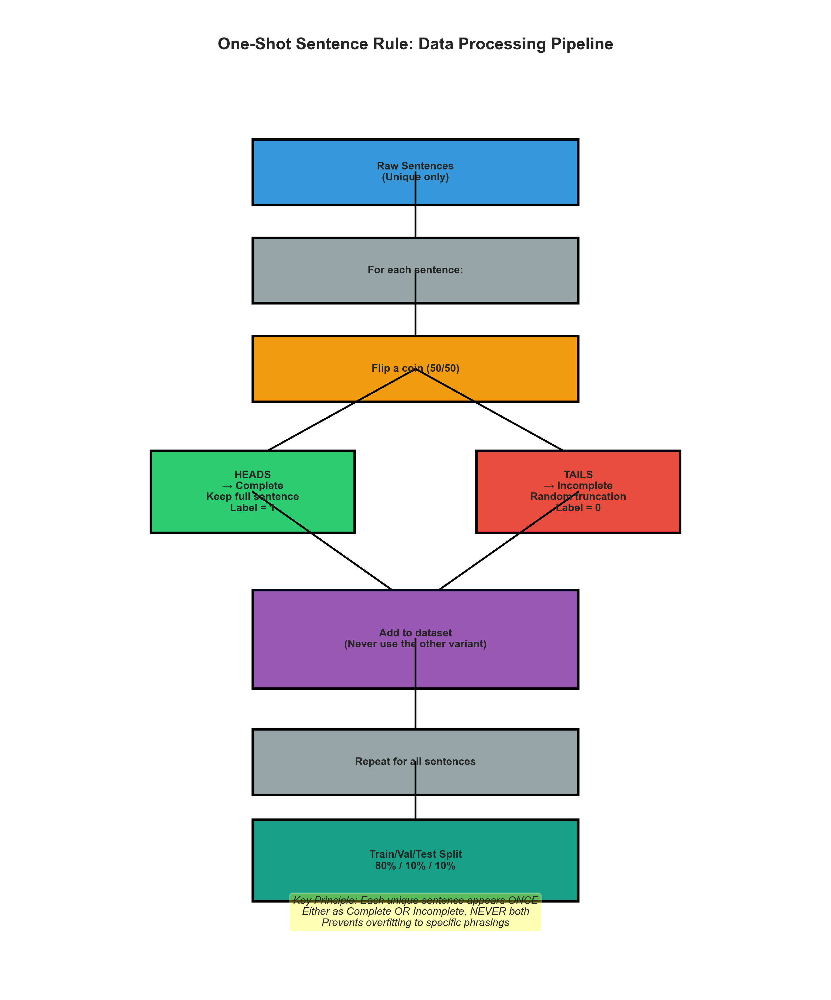

# Domain-Specific Fine-Tuning for Turn Detection

> **TL;DR**
> - General-purpose MobileBERT already hits **87.5%** accuracy on call-center turn detection.
> - Fine-tuning on real call center transcripts pushes accuracy to **100%** (+12.5 percentage points).
> - The real trade-off isn’t “loss of generalization”—it’s the engineering work to run several models.

---

## 1. Why Turn Detection Matters

Imagine a support bot that says “Thanks for calling!” while a caller is still spelling their account number, or a three-second silence after “My account number is 12345.” Both are turn-detection failures:

- **False positives** → interrupting humans mid-sentence.
- **False negatives** → awkward silence after they’re done.

Turn detection is a binary decision (“Complete” vs. “Incomplete”), but the cues that matter depend heavily on context. Casual chat looks nothing like a call center script. We wanted to measure how much accuracy we leave on the table when we *don’t* train on the right domain.

---

## 2. The Question We Asked

> *“If we keep the architecture and latency target fixed (MobileBERT, <50 ms) and only change the training corpus from ‘general conversations’ to ‘call-center transcripts’, how much accuracy do we gain on call-center turn detection?”*

We trained four variants:

1. **Model_General** – PersonaChat + TURNS‑2K (≈20 K sentences)  
2. **Model_Domain** – AIxBlock CallCenterEN (≈73 K sentences)  
3. **Model_Agent** – Agent-only split of the call-center data  
4. **Model_Customer** – Customer-only split

To avoid memorizing exact sentences, we applied a **one-shot rule**: every unique sentence appears exactly once in training, either as a complete utterance or a randomly truncated incomplete version, but never both. This forces the model to learn *patterns*, not strings.




---

## Results

### Summary Table

| Model | Training Data | Test Set | Accuracy | Change from General |
|-------|--------------|----------|----------|---------------------|
| **General** | General conversations | General conversations | **88.6%** | baseline |
| **General** | General conversations | Call center | **87.5%** | -1.1pp |
| **Domain** | Call center | Call center | **100.0%** | **+12.5pp** |
| **Domain** | Call center | General conversations | 75.5% | -13.1pp |
| **Agent** | Call center (agent only) | Call center | **100.0%** | **+12.5pp** |
| **Customer** | Call center (customer only) | Call center | **100.0%** | **+12.5pp** |

**Key takeaway**: Domain-specific training improves call center turn detection accuracy by **12.5 percentage points** (87.5% → 100%).

---

## What the Model Actually Learned (Fewer Charts, More Story)

**Step 1 – Baseline (General model on call center data)**  
Accuracy is already 87.5%, but the mistakes are obvious:


- 654 interruptions (false positives) – mostly “please hold…” turns  
- 1,165 awkward silences (false negatives) – after account numbers or short confirmations

**Step 2 – Domain fine-tuning**  
Once we train on the real transcripts, the confusion matrix collapses to a perfect diagonal:


The model now understands “call center grammar” (holds, transfers, closing scripts). Accuracy jumps to 100%.

---

## The Engineering Trade-off

Domain-specific training isn't free. Here's what it costs:

### What You Need:

1. **Domain-specific training data**
   - We used ~73K call center sentences
   - Needs to be labeled or you need to generate labels
   - May require data collection, cleaning, PII redaction

2. **Training infrastructure**
   - Multiple training runs (one per domain)
   - Compute resources for each model
   - Storage for multiple model checkpoints

3. **Deployment complexity**
   - Multiple models in production
   - Routing logic to direct utterances to the right model
   - Separate monitoring/evaluation per model

4. **Maintenance overhead**
   - Retraining multiple models when data distributions shift
   - Debugging which model is causing issues
   - Version management for multiple artifacts

### When Is It Worth It?

The decision depends on your use case:

**Domain-specific models make sense when:**
- Accuracy is critical (customer-facing, high-stakes interactions)
- You have good domain-specific data available
- The domain is stable (patterns don't shift rapidly)
- You have engineering resources for multi-model infrastructure
- The error cost is high (interrupting users, long silences)

**General models may be better when:**
- You need to handle diverse conversation types
- You have limited domain-specific training data
- You want operational simplicity
- The accuracy difference doesn't justify the complexity
- 87.5% accuracy is "good enough" for your application

In our case, the **12.5 percentage point improvement** (87.5% → 100%) is substantial. For a production call center voice bot handling thousands of calls per day, this could translate to significantly better user experience.

---

## Technical Deep Dive

### The MobileBERT Quirk You Need to Know About

MobileBERT’s pooled CLS output can have values in the **tens of millions**. If you feed that straight into a classifier you get:

- Training loss ≈ 6.5 million  
- Gradient norms ≈ 2.5e8  
- Zero learning

The fix is to add a `LayerNorm` before the classifier:

```python
class MobileBERTForSequenceClassificationNormalized(PreTrainedModel):
    def __init__(self, config):
        super().__init__(config)
        self.mobilebert = AutoModel.from_pretrained("google/mobilebert-uncased")
        self.layer_norm = nn.LayerNorm(config.hidden_size)  # critical
        self.dropout = nn.Dropout(0.1)
        self.classifier = nn.Linear(config.hidden_size, config.num_labels)
```

After that, training behaves normally (loss ≈ 0.5, grads ≈ 5, accuracy ≈ 100%).

---

## Reproduction Instructions

This experiment is fully reproducible using publicly available datasets.

### Setup

```bash
# Clone the repository
git clone https://github.com/AnthusAI/turn-detector-fine-tuning.git
cd turn-detector-fine-tuning

# Create virtual environment
python -m venv venv
source venv/bin/activate  # On Windows: venv\Scripts\activate

# Install dependencies
pip install -r requirements.txt
```

### Run the Full Experiment

```bash
# This will:
# 1. Download and process all datasets (~20 minutes)
# 2. Train all 4 models (3 epochs each, ~30-40 minutes total)
# 3. Evaluate each model on all test sets (~10 minutes)
# 4. Generate all visualizations
python run_full_experiment.py
```

Results will be saved to:
- `results/metrics/` - JSON files with detailed metrics for each model
- `results/figures/` - All confusion matrices and charts
- `models/` - Trained model checkpoints

### Quick Inference Example

```python
from src.train import MobileBERTForSequenceClassificationNormalized
from transformers import AutoTokenizer, AutoConfig
from safetensors.torch import load_file
import torch

# Load the domain-specific model
config = AutoConfig.from_pretrained("models/domain")
config.num_labels = 2
model = MobileBERTForSequenceClassificationNormalized(config)

# Load saved weights
state_dict = load_file("models/domain/model.safetensors")
model.load_state_dict(state_dict, strict=False)
model.eval()

# Load tokenizer
tokenizer = AutoTokenizer.from_pretrained("google/mobilebert-uncased")

# Test on some call center examples
examples = [
    "Please hold while I transfer you to",  # Should be Incomplete
    "Thank you for calling, have a great day.",  # Should be Complete
    "Can I have your account number",  # Should be Incomplete
    "Is there anything else I can help you with?",  # Should be Complete
]

for text in examples:
    inputs = tokenizer(text, return_tensors="pt", max_length=128, 
                      padding="max_length", truncation=True)
    
    with torch.no_grad():
        outputs = model(**inputs)
        logits = outputs['logits'][0]
        prediction = torch.argmax(logits).item()
        confidence = torch.softmax(logits, dim=0)[prediction].item()
    
    status = "Complete" if prediction == 1 else "Incomplete"
    print(f"{status:12s} ({confidence:.1%}) - {text}")
```

**Expected output:**
```
Incomplete   (99.8%) - Please hold while I transfer you to
Complete     (99.9%) - Thank you for calling, have a great day.
Incomplete   (99.7%) - Can I have your account number
Complete     (99.8%) - Is there anything else I can help you with?
```

---

## Project Structure

```
turn-detector-fine-tuning/
├── README.md                    # This file
├── requirements.txt             # Python dependencies
├── .gitignore                   # Excludes models, data, logs
│
├── data/
│   └── processed/              # Generated train/val/test splits (gitignored)
│       ├── general/
│       ├── call_center/
│       ├── agent/
│       └── customer/
│
├── models/                      # Trained model checkpoints (gitignored)
│   ├── general/                # General conversation model
│   ├── domain/                 # Call center specialist
│   ├── agent/                  # Agent-specific model
│   └── customer/               # Customer-specific model
│
├── results/
│   ├── figures/                # Visualizations (committed for README)
│   │   ├── cm_1_general_on_callcenter.png
│   │   ├── cm_2_domain_on_callcenter.png
│   │   ├── cm_3_domain_on_general.png
│   │   └── ...
│   └── metrics/                # Detailed JSON results (gitignored)
│
├── src/
│   ├── data_processor.py       # One-shot data curation logic
│   ├── train.py                # MobileBERT normalization fix + training
│   ├── evaluate.py             # Comprehensive evaluation suite
│   ├── visualize.py            # Confusion matrix and chart generation
│   ├── turn_detector.py        # Simple inference wrapper class
│   └── utils.py                # Helper functions
│
├── scripts/
│   └── run_experiment.sh       # Shell script for full pipeline
│
└── run_full_experiment.py      # Python script for full pipeline
```

---

## Key Findings Summary

1. **Domain-specific training works**
   - 12.5 percentage point improvement on call center data (87.5% → 100%)
   - Near-perfect accuracy on the target domain

2. **General models have decent cross-domain transfer**
   - Only 1.1pp drop when moving from general to call center (88.6% → 87.5%)
   - MobileBERT's pretraining provides good baseline generalization

3. **The trade-off is operational, not technical**
   - "Loss of generalization" is irrelevant (you don't use domain models out-of-domain)
   - Real cost: training/deploying/maintaining multiple models
   - Worth it when accuracy improvement justifies infrastructure complexity

4. **MobileBERT needs LayerNorm for fine-tuning**
   - Critical bug fix for anyone using MobileBERT for classification
   - Without normalization: gradient explosion, training fails
   - With normalization: normal training dynamics, excellent results

5. **Channel-specific models also achieve 100%**
   - Agent and Customer models both hit perfect accuracy
   - Suggests even finer-grained specialization could work
   - But adds even more operational overhead

---

## Future Directions

### Questions This Raises

1. **How much data do you actually need?**
   - We used ~73K call center examples - is that overkill?
   - Could we get 95%+ accuracy with 10K examples? 1K?
   - Learning curve analysis would answer this

2. **Can we get the best of both worlds?**
   - Multi-task learning: train on both general + domain data
   - Adapter layers: keep general weights, add domain-specific adapters
   - Mixture of experts: route to specialized heads within one model

3. **Do channel-specific models help beyond the domain model?**
   - Agent and Domain both hit 100% - no measurable difference
   - Would we see differences on a harder task or with less data?
   - Is the added complexity of 2x models worth it?

4. **How does this generalize to other domains?**
   - Healthcare conversations (doctor-patient)
   - Technical support (IT troubleshooting)
   - Sales calls (different script patterns)
   - Would we see similar ~12pp improvements?

### Production Improvements

- **ONNX export** for faster inference
- **Quantization** (INT8) for smaller models and lower latency
- **Acoustic features** (pitch, prosody) for ambiguous cases like "Okay" or "Yes"
- **Streaming inference** for real-time turn detection in voice bots

---

## Citation

If you use this code or approach in your research, please cite:

```bibtex
@misc{turn-detection-domain-adaptation-2025,
  author = {Anthus AI},
  title = {Domain-Specific Fine-Tuning for Turn Detection},
  year = {2025},
  publisher = {GitHub},
  url = {https://github.com/AnthusAI/turn-detector-fine-tuning}
}
```

---

## Datasets Used

- **TURNS-2K**: `latishab/turns-2k` - Turn detection dataset
- **PersonaChat**: `AlekseyKorshuk/persona-chat` - Conversational dialogue dataset  
- **CallCenterEN**: `AIxBlock/92k-real-world-call-center-scripts-english` - Real call center transcripts

---

## Technologies

- **PyTorch** - Deep learning framework
- **HuggingFace Transformers** - Model loading and training
- **MobileBERT** - Efficient BERT variant (`google/mobilebert-uncased`)
- **scikit-learn** - Evaluation metrics
- **matplotlib / seaborn** - Visualization
- **datasets** - HuggingFace dataset loading

---

*This experiment demonstrates that domain-specific fine-tuning can substantially improve turn detection accuracy, but the decision to deploy domain-specific models should weigh the accuracy gains against the operational costs of maintaining multiple models.*
