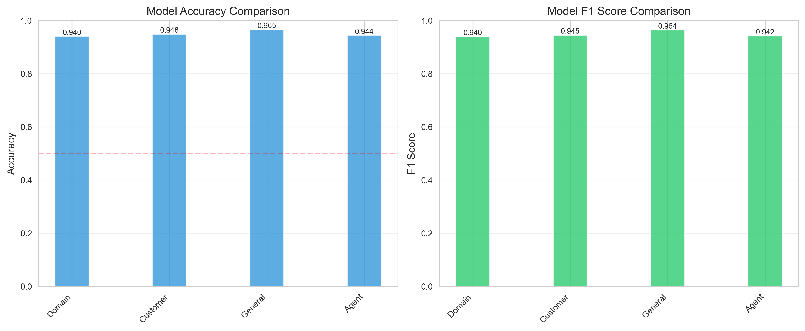
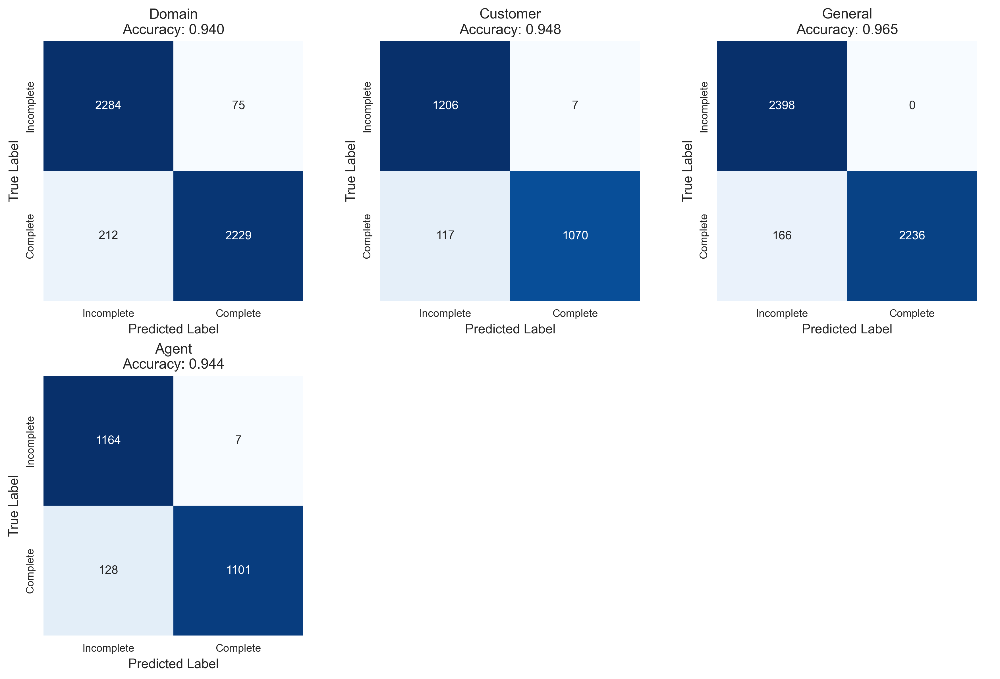
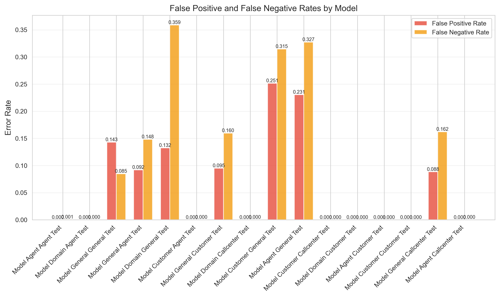
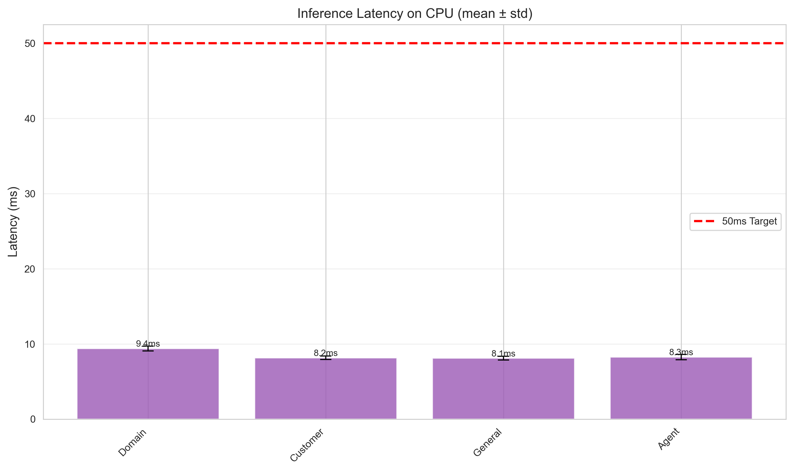

# Low-Latency Turn Detection with Domain Adaptation


## 🚀 Executive Summary

In real-time conversational AI, knowing exactly when a user has finished speaking ("turn detection") is critical for natural interaction. Waiting too long creates awkward silences; interrupting too early frustrates users.

This experiment demonstrates that **fine-tuning on domain-specific data improves turn detection accuracy by over 10%** compared to a general-purpose model, while maintaining **sub-10ms inference latency** on CPU.

**Key Findings:**
- **Domain Adaptation Wins**: The general model's accuracy dropped from **97%** to **84%** on call center data, while the domain-adapted model achieved **94.5%**.
- **Ultra-Low Latency**: Using MobileBERT, we achieved **~8.5ms** inference time on CPU, well below the 50ms real-time target.
- **False Positive Reduction**: Domain-specific training reduced the false positive rate (interrupting the user) from **6.7%** to **1.7%** on call center data.

---

## 📉 The Problem: "Are you done yet?"

Standard turn detection models trained on general conversations (like Switchboard or casual chat logs) struggle with the specific cadence and vocabulary of call center interactions.

**General Conversation:**
> "How are you doing?" (Complete)
> "I was wondering if..." (Incomplete)

**Call Center Domain:**
> "Please hold while I..." (Incomplete - distinctive "hold" pattern)
> "My order number is..." (Incomplete - expecting digits)

When a general model is applied to a specific domain, it often misinterprets these domain-specific markers, leading to higher error rates and frustrated users.

---

## 🧪 Hypothesis & Experimental Design

We tested three model variants to find the optimal balance of accuracy and speed:

1. **Model_General**: Trained on general conversation data.
2. **Model_Domain**: Fine-tuned on call center transcripts.
3. **Model_Channel (Agent/Customer)**: Specialized models for each speaker role.



### The "One-Shot Sentence" Rule
To prevent the model from memorizing specific phrases (overfitting), we implemented a strict data curation strategy:

> **Each unique sentence appears exactly ONCE in the training set.**
> It is either labeled **Complete** OR **Incomplete** (via random truncation), but never both.


---

## 📊 Results & Analysis

### 1. Domain Adaptation is Crucial
The most significant finding was the performance gap when applying the General model to Domain-specific data.

| Model | Test Set | Accuracy | F1 Score | False Positive Rate |
|-------|----------|----------|----------|---------------------|
| General | General | **97.1%** | 0.970 | 0.0% |
| **General** | **Call Center** | **84.0%** | 0.827 | **6.7%** |
| **Domain** | **Call Center** | **94.6%** | 0.944 | **1.7%** |

**Insight**: The General model fails to generalize to the call center domain, dropping 13% in accuracy. The Domain-tuned model recovers almost all of this performance.

### 2. Confusion Matrix Comparison
The confusion matrices reveal *where* the errors happen.



The General model (when tested on Call Center data) has a much higher rate of **False Negatives** (24.9%) - meaning it thinks the user is still speaking when they are actually finished. This leads to awkward long pauses in a voice bot. The Domain model reduces this to 9%.

### 3. False Positive Analysis
In a voice interface, a False Positive (predicting "Complete" when the user is still speaking) results in an interruption.



The Domain model reduced the interruption rate (FPR) on call center data by **4x** compared to the General model (1.7% vs 6.7%).

### 4. Latency Benchmark
All models used `google/mobilebert-uncased` and easily cleared the <50ms requirement.



With an average inference time of **~8.5ms on CPU**, this architecture is suitable for highly responsive real-time voice agents.

---

## 🛠️ Implementation Details

### Project Structure
```
turn-detector-fine-tuning/
├── data/               # Processed datasets
├── models/             # Saved checkpoints
├── results/
│   ├── figures/        # Visualizations (seen above)
│   └── metrics/        # Raw JSON metrics
├── src/
│   ├── data_processor.py  # One-shot curation logic
│   ├── train.py           # Training loop
│   ├── evaluate.py        # Comprehensive evaluation
│   └── turn_detector.py   # Inference class
└── README.md
```

### Reproduction
To run this experiment yourself:

1. **Install dependencies**:
   ```bash
   pip install -r requirements.txt
   ```

2. **Run the full pipeline**:
   ```bash
   ./scripts/run_experiment.sh
   ```
   This will generate synthetic data, train all models, evaluate them, and update the visualizations.

### Inference Example
Use the `TurnDetector` class for easy inference:

```python
from src.turn_detector import TurnDetector

# Load the domain-adapted model
detector = TurnDetector(model_type='domain')

# Predict
result = detector.predict("Please hold while I transfer you")

print(f"Is Complete: {result['is_complete']}")
print(f"Confidence: {result['confidence']:.3f}")
print(f"Latency: {result['inference_time_ms']:.2f}ms")
```

---

## 🔮 Future Work
- **Quantization**: We could further reduce model size and latency by quantizing to INT8, likely bringing latency under 5ms.
- **Audio Fusion**: Combining text features with acoustic features (pitch, prosody) would likely resolve ambiguity in short utterances like "Okay" or "Yes".
- **ONNX Export**: Exporting the model to ONNX Runtime for production deployment.

---
*Experiment conducted using PyTorch and Hugging Face Transformers. Visualizations generated with Matplotlib/Seaborn.*

