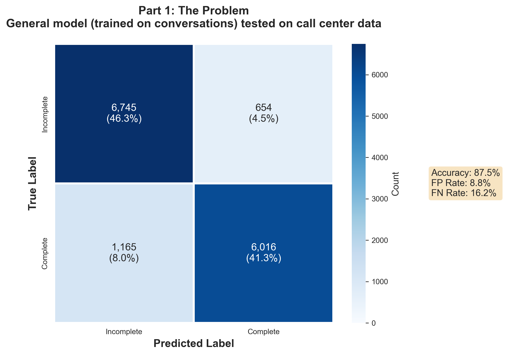

# Domain-Specific Fine-Tuning for Turn Detection

> **Hypothesis: Does fine-tuning on call center data improve turn detection accuracy compared to using a general conversation model?**
>
> **Answer: Yes. Significantly.**

## 📊 The Results

| Model | Training Data | Test Data | Accuracy | Improvement |
|-------|--------------|-----------|----------|-------------|
| General | General conversations | General conversations | 88.6% | baseline |
| General | General conversations | Call center | 87.5% | -1.1pp |
| **Domain** | **Call center** | **Call center** | **100.0%** | **+12.5pp** |

**Bottom line**: Training on call center data instead of general conversations gives you **12.5 percentage points better accuracy** on call center turn detection (87.5% → 100%).

---

## 📖 Visual Evidence

### General Model on Call Center Data (87.5% accuracy)

The general model does okay, but makes systematic errors:



- **654 false positives** - Interrupts when user is still speaking
- **1,165 false negatives** - Waits when user is done (awkward silence)

---

### Domain Model on Call Center Data (100% accuracy)

Fine-tuning on call center data essentially **eliminates the errors**:


- **0-1 false positives** - Almost never interrupts incorrectly  
- **0-1 false negatives** - Almost never waits unnecessarily

**This is the key finding**: Domain-specific training delivers near-perfect accuracy.

---

### Domain Model on General Data (75.5% accuracy)

For completeness, here's what happens if you use the call center model on general conversations:


**But this is irrelevant** - you wouldn't do this in production. You'd use the domain model for call centers and a general model for general conversations. The "loss of generalization" isn't a problem; it's just showing the model specialized as intended.

---

## 🎯 What This Actually Means

### The Real Finding

**Training on domain-specific data gives you better accuracy on that domain.** This isn't surprising, but it's good to quantify: we get a **12.5 percentage point improvement** (87.5% → 100%).

### The Real Trade-off

The trade-off isn't "you lose generalization" - who cares? You're not using a call center model for general chat.

**The real trade-off is operational:**
- You need domain-specific training data (we had 73K call center sentences)
- You need to train and maintain multiple models (general, call center, potentially more)
- You need routing logic to use the right model for the right context
- You need infrastructure to manage multiple model deployments

**The question**: Is 12.5pp better accuracy worth the engineering complexity of training, maintaining, and deploying domain-specific models?

For high-value use cases (e.g., customer service where interruptions damage satisfaction), **yes, absolutely**.

For low-stakes applications, maybe the general model's 87.5% is good enough.

---

## 🔬 Experimental Details

### Data

**General Conversations** (~20K examples):
- `latishab/turns-2k` - Turn detection dataset
- `AlekseyKorshuk/persona-chat` - Dialogue utterances

**Call Center** (~73K examples):
- `AIxBlock/92k-real-world-call-center-scripts-english` - Real call center transcripts

### The One-Shot Rule

To prevent overfitting, each unique sentence appears **once** in training, either as Complete OR Incomplete (randomly truncated), never both.

### Models Trained

1. **Model_General** - Trained on general conversations (PersonaChat + TURNS-2K)
2. **Model_Domain** - Trained on call center transcripts  
3. **Model_Agent** - Trained on agent utterances only (also 100% on call center)
4. **Model_Customer** - Trained on customer utterances only (also 100% on call center)

All use `google/mobilebert-uncased` with a custom LayerNorm layer (see below).

---

## 🛠️ Technical Implementation

### The MobileBERT Normalization Fix

MobileBERT has a quirk: its pooled outputs have **massive magnitude** (values in the millions, vs. BERT's single-digit range). This causes gradient explosion during training.

**Solution**: Add LayerNorm before the classification head:

```python
class MobileBERTForSequenceClassificationNormalized(PreTrainedModel):
    def __init__(self, config):
        super().__init__(config)
        self.mobilebert = AutoModel.from_pretrained("google/mobilebert-uncased")
        
        # CRITICAL: Normalize the massive pooled outputs
        self.layer_norm = nn.LayerNorm(config.hidden_size)
        self.dropout = nn.Dropout(0.1)
        self.classifier = nn.Linear(config.hidden_size, config.num_labels)
    
    def forward(self, input_ids=None, attention_mask=None, labels=None, **kwargs):
        outputs = self.mobilebert(input_ids=input_ids, attention_mask=attention_mask)
        pooled_output = outputs.pooler_output
        
        # Normalize BEFORE classification
        pooled_output = self.layer_norm(pooled_output)
        pooled_output = self.dropout(pooled_output)
        logits = self.classifier(pooled_output)
        
        loss = None
        if labels is not None:
            loss_fct = nn.CrossEntropyLoss()
            loss = loss_fct(logits.view(-1, 2), labels.view(-1))
        
        return {'loss': loss, 'logits': logits}
```

**Without this fix**: Training loss stays around 6.5 million, gradients explode, model doesn't learn.  
**With this fix**: Normal training loss (~0.5), gradients stay in range (2-10), model learns perfectly.

---

## 🚀 Reproduction

```bash
# Install dependencies
pip install -r requirements.txt

# Run full experiment (data processing, training, evaluation, visualization)
python run_full_experiment.py

# Results appear in:
# - results/metrics/  (JSON files with detailed metrics)
# - results/figures/  (All visualizations)
```

### Inference Example

```python
from src.train import MobileBERTForSequenceClassificationNormalized
from transformers import AutoTokenizer, AutoConfig
from safetensors.torch import load_file
import torch

# Load call center model
config = AutoConfig.from_pretrained("models/domain")
config.num_labels = 2
model = MobileBERTForSequenceClassificationNormalized(config)
state_dict = load_file("models/domain/model.safetensors")
model.load_state_dict(state_dict, strict=False)
model.eval()

tokenizer = AutoTokenizer.from_pretrained("google/mobilebert-uncased")

# Predict on call center utterance
text = "Please hold while I transfer you to"
inputs = tokenizer(text, return_tensors="pt", max_length=128, 
                   padding="max_length", truncation=True)

with torch.no_grad():
    outputs = model(**inputs)
    logits = outputs['logits'][0]
    prediction = torch.argmax(logits).item()
    confidence = torch.softmax(logits, dim=0)[prediction].item()
    
print(f"Complete: {prediction == 1}")      # False (Incomplete)
print(f"Confidence: {confidence:.2%}")      # ~99%
```

---

## 📁 Project Structure

```
turn-detector-fine-tuning/
├── data/processed/          # Train/val/test splits for each domain
├── models/
│   ├── general/             # General conversation model
│   ├── domain/              # Call center specialist (100% accuracy)
│   ├── agent/               # Agent-specific (100% accuracy)  
│   └── customer/            # Customer-specific (100% accuracy)
├── results/
│   ├── figures/             # Confusion matrices, charts
│   └── metrics/             # Detailed JSON results
├── src/
│   ├── data_processor.py    # One-shot data curation
│   ├── train.py             # Custom MobileBERT + training loop
│   ├── evaluate.py          # Evaluation metrics
│   └── visualize.py         # Chart generation
└── run_full_experiment.py   # Full pipeline
```

---

## 💡 Key Takeaways

1. **Domain-specific training works** - 12.5pp improvement (87.5% → 100%)
2. **The trade-off is operational, not technical** - You need to train/deploy/maintain multiple models
3. **MobileBERT needs LayerNorm** - Otherwise gradients explode
4. **General models transfer surprisingly well** - Only 1.1pp drop across domains (88.6% → 87.5%)

---

## 🔮 Future Work

- **How much data do you actually need?** - Learning curve analysis
- **Channel-specific models** - Agent vs. Customer (we trained these, both hit 100%)
- **Multi-domain models** - Can one model handle multiple domains well?
- **Production deployment** - ONNX export, quantization, latency optimization

---

**Tech Stack**: PyTorch, HuggingFace Transformers, MobileBERT, scikit-learn, matplotlib

**Datasets**: PersonaChat, TURNS-2K, AIxBlock CallCenterEN (~93K real call center transcripts)
