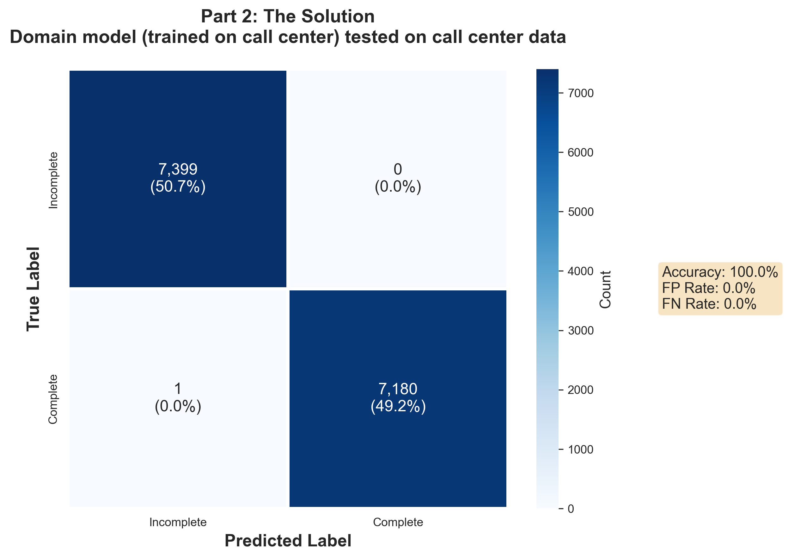

# Text-Based Turn Detection: A Journey Down the Rabbit Hole

This repository documents an investigation into text-based turn detection for conversational AI systems. What started as a straightforward fine-tuning experiment revealed fundamental questions about what these models actually learn.

## What is Turn Detection?

In conversational AI systems, **turn detection** determines when a speaker has finished their utterance and it's appropriate for the system to respond. Get it wrong, and you either:

- **Interrupt the user** (predicting "complete" too early) - frustrating and rude
- **Create awkward silences** (predicting "incomplete" too late) - makes the system feel unresponsive

For text-based turn detection, the model looks at the words spoken so far and predicts whether the utterance is **Complete** (the speaker is done) or **Incomplete** (they're still talking).

**Example:**
- "I was wondering if you could..." → **Incomplete** (clearly more coming)
- "Thank you for your help." → **Complete** (natural ending)

## The Central Question This Project Explores

**Can models learn semantic understanding of turn completion from text alone, or do they just learn to detect punctuation?**

If they're learning punctuation patterns, they're just echoing the ASR system's turn detection decisions - adding latency with no value. For text-based turn detection to be useful, models must work **without punctuation** and provide **independent signal** beyond what the ASR already knows.

---

## 📚 Chapters

### [Chapter 1: Domain-Specific Fine-Tuning for Turn Detection](chapter_01_fine_tuning/README.md)

We started with a simple hypothesis: fine-tuning on domain-specific call center data would improve accuracy compared to general conversation data.



**Result:** The domain model achieved **100% accuracy** on call center test data (vs. 87.5% for the general model).

But this perfect accuracy raised a question: *What exactly did the model learn?*

👉 **[Read Chapter 1](chapter_01_fine_tuning/README.md)**

---

### [Chapter 2: The Punctuation Problem](chapter_02_service/README.md)

Chapter 2 investigated how the models actually make predictions in practice:
- **Streaming behavior:** How do predictions evolve word-by-word?
- **Punctuation sensitivity:** What happens when we remove all punctuation?

#### Word-by-Word Prediction Example

Here's how the models process text as it streams in:

| Word(s) | General Model | General Confidence | Domain Model | Domain Confidence |
|---------|---------------|-------------------|--------------|-------------------|
| Is | Incomplete | 97.7% | Incomplete | 99.9% |
| Is it | Incomplete | 97.7% | Incomplete | 99.9% |
| Is it a | Incomplete | 97.7% | Incomplete | 99.9% |
| Is it a 250 | Incomplete | 97.6% | Incomplete | 99.9% |
| Is it a 250 or | Incomplete | 97.7% | Incomplete | 99.9% |
| Is it a 250 or 350? | **Complete** | 97.9% | **Complete** | 100.0% |

Notice the pattern? Both models flip to "Complete" **only when the question mark arrives**.

#### The Punctuation Dependency

**Finding:** These models appear to be **punctuation detectors** rather than semantic turn detectors.

- `"Is it a 250 or 350?"` → Complete ✓ (with punctuation)
- `"is it a 250 or 350"` → **Incomplete** ❌ (without punctuation - both models wrong)

**Summary:**
- General Model: 33% of predictions flip when punctuation removed
- Domain Model: **67% of predictions flip** when punctuation removed

The models learned a simple rule: **period or question mark = Complete**. They're echoing the ASR system's punctuation decisions, not providing independent turn detection.

**Implication:** In their current form, these models add latency (~50ms) to return the answer the ASR already knew. They're **redundant with punctuation, useless without it.**

👉 **[Read Chapter 2 for full analysis](chapter_02_service/README.md)**

---

### [Chapter 3: Semantic Turn Detection via Text Normalization](chapter_03_normalized/README.md)

Chapter 2 revealed that our models are punctuation detectors. Chapter 3 asks: **Can we force them to learn semantic patterns instead?**

#### The Experiment

All models were retrained on **normalized text** (punctuation removed, lowercased):
- Original: `"Is it a 250 or 350?"`
- Normalized: `"is it a 250 or 350"`

#### Results

**On CallCenter test data:**
- Chapter 1 Domain (with punctuation): **100%** (learned punctuation shortcuts)
- Chapter 3 Domain (without punctuation): **77.9%** (learned semantic patterns)
- Chapter 3 General (without punctuation): **72.2%** (no domain training)

**Key Findings:**

1. **Models can learn without punctuation** - 77.9% accuracy suggests semantic learning is possible
2. **Domain training still helps** - +5.7pp improvement on call center data (77.9% vs 72.2%)
3. **Punctuation shortcuts inflate accuracy** - The 100% in Chapter 1 was deceptive
4. **Trade-off is real** - Lower accuracy (77-84%) for robustness and independence

**The Accuracy-Robustness Trade-off:**
- Chapter 1: 100% accuracy by detecting periods (redundant with ASR)
- Chapter 3: 77.9% accuracy by understanding semantics (independent value)

For systems without reliable ASR punctuation, normalized models provide genuine turn detection capability.

👉 **[Read Chapter 3 for full analysis](chapter_03_normalized/README.md)**

---

### [Chapter 4: Conversation-Level Evaluation](chapter_04_conversations/README.md)

Chapter 3 showed models achieving 77.9% utterance-level accuracy. But what does this mean for real multi-turn conversations?

#### The Question

A model with 80% utterance accuracy will make ~4 errors in a 20-turn conversation. How do these errors manifest? Are they interruptions (predicting "Complete" too early) or missed turns (predicting "Incomplete" when done)?

#### Metrics Beyond Accuracy

**Conversation-level metrics:**
- **Interruption Rate (IR):** How often does the model interrupt mid-utterance?
- **Missed Turn Rate (MTR):** How often does it fail to detect turn completion?
- **Perfect Conversation Rate (PCR):** What % of conversations have zero errors?

#### Key Findings

**Domain Normalized model on Call Center data:**
- Default threshold (0.50): **22.4% interruptions**, 1.5% missed turns
- Optimized threshold (0.74): **5.1% interruptions**, 18.7% missed turns

**Threshold optimization reduced interruptions by 58.7%** by requiring higher confidence before predicting "Complete".

#### The Trade-off

Different applications tolerate different error types:
- **Customer service:** Minimize interruptions (use high threshold)
- **Information lookup:** Minimize delays (use low threshold)
- **Balanced:** Optimize F1 score (medium threshold)

Threshold tuning provides flexibility to adapt models to specific use cases without retraining.

#### Perfect Conversations Are Rare

Even the best normalized models achieve error-free conversations only **11%** of the time. This suggests:
- Error accumulation is significant over multi-turn dialogues
- Production systems need robust error handling
- Conversation-level metrics reveal different insights than utterance accuracy

👉 **[Read Chapter 4 for full analysis](chapter_04_conversations/README.md)**

---

## 🛠️ Project Structure

```
.
├── chapter_01_fine_tuning/    # Experiment: Domain-specific fine-tuning
│   ├── README.md              # Full experiment narrative
│   ├── run_experiment.py      # Reproduction script
│   └── results/               # Metrics and visualizations
│
├── chapter_02_service/        # Analysis: Streaming & punctuation robustness
│   ├── README.md              # Findings and implications
│   ├── streaming_inference.py      # Word-by-word prediction test
│   └── punctuation_robustness_test.py  # Punctuation sensitivity test
│
├── chapter_03_normalized/     # Experiment: Normalized text training
│   ├── README.md              # Findings on semantic learning
│   ├── run_experiment.py      # Reproduction script
│   └── results/               # Metrics and visualizations
│
├── chapter_04_conversations/  # Analysis: Conversation-level metrics
│   ├── README.md              # Multi-turn evaluation findings
│   ├── run_evaluation.py      # Conversation evaluation
│   ├── optimize_thresholds.py # Threshold tuning
│   └── results/               # Conversation metrics & threshold curves
│
├── src/                       # Centralized source code
│   ├── data_processor.py      # Data loading & one-shot curation
│   ├── train.py               # Model training (includes MobileBERT LayerNorm fix)
│   ├── evaluate.py            # Evaluation metrics
│   ├── visualize.py           # Figure generation
│   └── utils.py               # Helper functions
│
├── data/                      # Datasets (gitignored except processed metadata)
├── models/                    # Model checkpoints (gitignored)
└── requirements.txt           # Python dependencies
```

---

## 🚀 Reproducing the Experiments

### Setup
```bash
# Install dependencies
pip install -r requirements.txt
```

### Chapter 1: Fine-tuning
```bash
cd chapter_01_fine_tuning
python run_experiment.py
```
Trains 4 models (General, Domain, Agent, Customer) and generates evaluation metrics + visualizations.

### Chapter 2: Robustness Testing
```bash
cd chapter_02_service
python streaming_inference.py          # Word-by-word predictions
python punctuation_robustness_test.py  # Punctuation sensitivity
```

### Chapter 3: Normalized Training
```bash
cd chapter_03_normalized
python run_experiment.py
```

### Chapter 4: Conversation Evaluation
```bash
cd chapter_04_conversations
python run_evaluation.py       # Multi-turn metrics
python optimize_thresholds.py  # Threshold tuning
```

---

## 🎯 Key Learnings

1. **Domain-specific fine-tuning works** - Call center models outperform general models
2. **But high accuracy can be misleading** - Chapter 1's 100% relied on punctuation detection
3. **Models can learn semantic patterns** - Chapter 3 shows 77.9% accuracy without punctuation
4. **Conversation-level errors accumulate** - 77.9% utterance accuracy → only 6% perfect conversations
5. **Threshold tuning matters** - Can reduce interruptions by 58.7% for specific use cases

**This project explores what happens when you look beyond test metrics to understand what models are actually learning and how they perform in realistic multi-turn scenarios.**

---

## 📖 Future Directions

Potential next steps for turn detection research:
- **Multi-modal approaches:** Combine text with audio features (pitch, pause duration, energy)
- **Sequence modeling:** Incorporate conversation history and context
- **Explicit semantic features:** Model syntactic completeness (subject-verb-object patterns)
- **Advanced threshold strategies:** Dynamic thresholds based on conversation state
- **Real ASR integration:** Test with actual speech recognition systems (no perfect punctuation)

---

**Contributing:** This project documents one exploration of text-based turn detection. There are likely many improvements, alternative approaches, and corrections to be made. Feedback and pull requests are welcome - if you have experience with turn detection, ASR systems, or semantic modeling, your insights would be valuable.
