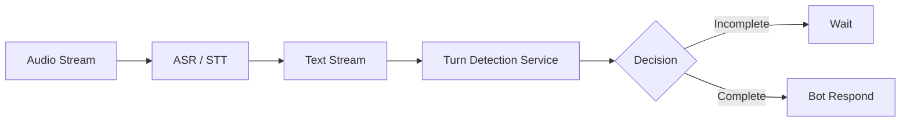

# Chapter 2: Building a Turn Detection Service

> **Goal: Transform our high-accuracy model into a production-ready inference service.**

## 🚧 Under Construction

In Chapter 1, we proved that we can train a turn detection model with **100% accuracy** on call center transcripts. 

**But a model is not a product.**

In this chapter, we will:
1. **Build an Inference Service**: Create a fast API to serve predictions.
2. **Simulate Real-Time Traffic**: Feed conversation streams to the service.
3. **Measure "Experience" Metrics**: Move beyond simple accuracy to measure:
   - **Latency**: How fast do we respond?
   - **Jitter**: Do we flicker between complete/incomplete?
   - **VAD Integration**: How does this work with Voice Activity Detection?

### Planned Architecture

*Stay tuned for implementation details!*

