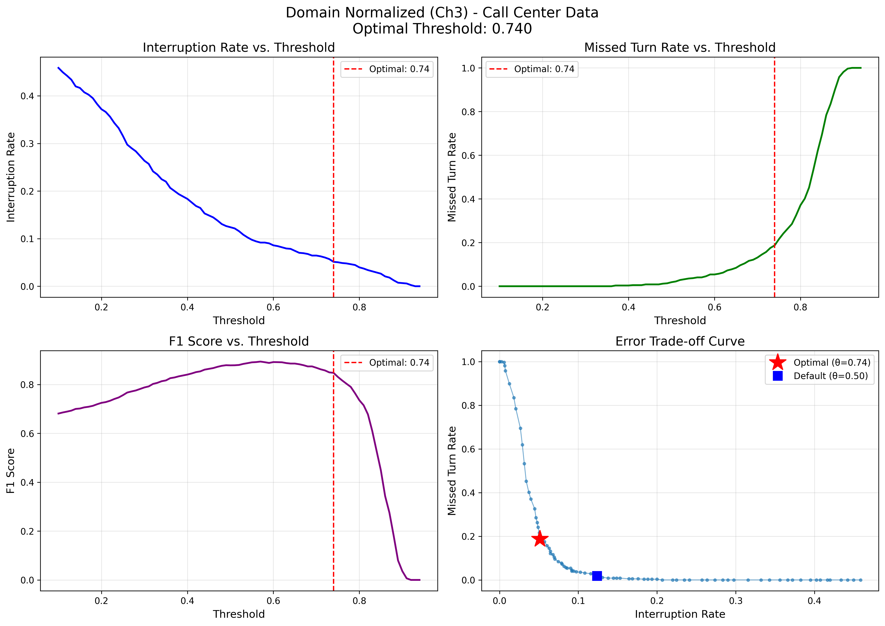

# Chapter 4: Conversation-Level Evaluation

> **Beyond Utterance Accuracy**: How do turn detection models perform in multi-turn conversations?

---

## The Question

Chapters 1-3 evaluated models on isolated utterances:
- Domain Normalized: 77.9% accuracy
- General: 88.6% accuracy

But what does this mean for actual conversations with 10-20 sequential turns? How often do models interrupt users or miss turn boundaries?

This chapter explores conversation-level metrics that may better reflect real-world performance.

---

## Motivation

**Utterance-level accuracy has limitations:**

A model with 80% utterance accuracy evaluated on a 20-turn conversation:
- Expected errors: 20 × 0.20 = 4 errors per conversation
- One interruption can disrupt the entire interaction
- Errors accumulate across turns

**We need metrics that capture:**
1. User experience impact (interruptions vs. delays)
2. Error accumulation over multi-turn sequences
3. Conversation-level success rates

---

## Metrics

### Primary Metrics

**1. Interruption Rate (IR)**
```
IR = False Positives / Total Utterances
```
- Measures how often the model incorrectly predicts "Complete" and interrupts mid-utterance
- Generally considered the most disruptive failure mode

**2. Missed Turn Rate (MTR)**
```
MTR = False Negatives / Total Complete Turns
```
- Measures how often the model fails to detect turn completion
- Can cause awkward silences

**3. Conversation F1 Score**
```
F1 = 2 × (Precision × Recall) / (Precision + Recall)
```
- Balances interruptions and missed turns
- Aggregated across all turns in all conversations

**4. Perfect Conversation Rate (PCR)**
```
PCR = Conversations with Zero Errors / Total Conversations
```
- Percentage of conversations with no interruptions or missed turns
- Strict metric that reflects whether consistent performance is achievable

---

## Experimental Setup

### Data

**Conversation Sequences:**
- 100 call center conversations (5-20 turns each, 1,210 total utterances)
- 100 general conversations (5-15 turns each, 1,013 total utterances)

Conversations created using sliding windows over test sets to maintain sequential coherence.

### Models Evaluated

**Chapter 1 (with punctuation):**
- General
- Domain

**Chapter 3 (normalized text):**
- General Normalized
- Domain Normalized

### Evaluation Method

For each utterance, we simulate word-by-word streaming and track when the model first predicts "Complete". This captures:
- Whether the prediction matches the ground truth
- Whether interruptions occur before utterance completion
- Detection timing

---

## Results

### Call Center Conversations

| Model | IR ↓ | MTR ↓ | F1 ↑ | PCR ↑ |
|-------|------|-------|------|-------|
| **Domain (Ch1)** | 0.0% | 0.0% | 1.000 | 100.0% |
| **General (Ch1)** | 6.7% | 16.4% | 0.848 | 20.0% |
| **General Normalized (Ch3)** | 10.5% | 22.1% | 0.782 | 11.0% |
| **Domain Normalized (Ch3)** | 22.4% | 1.5% | 0.807 | 6.0% |

### General Conversations

| Model | IR ↓ | MTR ↓ | F1 ↑ | PCR ↑ |
|-------|------|-------|------|-------|
| **General (Ch1)** | 17.1% | 5.1% | 0.830 | 11.0% |
| **Domain (Ch1)** | 16.1% | 29.4% | 0.697 | 2.0% |
| **General Normalized (Ch3)** | 20.9% | 2.7% | 0.815 | 8.0% |
| **Domain Normalized (Ch3)** | 37.8% | 0.8% | 0.725 | 1.0% |

---

## Key Observations

### 1. Domain (Ch1) Achieves Perfect Performance

On call center conversations, the punctuation-dependent Domain model shows:
- 0% interruptions, 0% missed turns
- 100% of conversations error-free

However, Chapter 2 showed this model relies on punctuation detection. This "perfect" performance may not translate to real ASR systems without reliable punctuation.

### 2. Error Accumulation is Significant

Even models with high utterance accuracy show substantial conversation-level errors:
- General Normalized: 84% utterance accuracy → only 11% perfect conversations
- Domain Normalized: 77.9% utterance accuracy → only 6% perfect conversations

Over 10+ turn conversations, small error rates compound.

### 3. Normalized Models Show Bias Toward "Complete"

The Domain Normalized model exhibits:
- High interruption rate (22.4%)
- Low missed turn rate (1.5%)

This suggests the model learned to predict "Complete" more readily, possibly because detecting incompleteness without punctuation is harder.

### 4. Generalization Challenges

Domain models struggle on general conversations:
- Domain (Ch1): 29.4% missed turns on general data
- Domain Normalized: 37.8% interruptions on general data

Specialization comes at the cost of broader applicability.

---

## Threshold Optimization

### The Problem

Default classification threshold (0.50) may not be optimal for all applications. The Domain Normalized model's 22.4% interruption rate is problematic for customer service.

### Approach

We explored adjusting the decision threshold for "Complete" predictions to find better trade-offs between interruptions and missed turns.

### Results: Domain Normalized on Call Center Data

| Threshold | IR ↓ | MTR ↓ | F1 | Use Case |
|-----------|------|-------|-----|----------|
| **0.500** (default) | 12.4% | 1.9% | 0.878 | Baseline |
| **0.570** (F1-optimal) | 9.2% | 4.0% | 0.894 | Balanced performance |
| **0.740** (IR-minimizing) | **5.1%** | 18.7% | 0.848 | Customer service |

**Interpretation:**

By raising the threshold to 0.74, we require higher confidence before predicting "Complete". This:
- Reduces interruptions by 58.7% (12.4% → 5.1%)
- Increases missed turns (1.9% → 18.7%)
- May be acceptable for applications where interruptions are more costly than delays



### General Normalized Results

| Threshold | IR ↓ | MTR ↓ | F1 | Use Case |
|-----------|------|-------|-----|----------|
| **0.500** (default) | 7.4% | 22.1% | 0.807 | Baseline |
| **0.610** (IR-minimizing) | **5.4%** | 28.2% | 0.786 | Low interruptions |

Similar pattern: higher thresholds reduce interruptions at the cost of more missed turns.

---

## Implications

### 1. Conversation-Level Metrics Matter

Utterance accuracy alone doesn't predict conversation-level performance. A 77.9% accurate model can still produce usable results (5.1% interruptions with threshold tuning), but only 6% of conversations are error-free.

### 2. Threshold Tuning Provides Flexibility

Different applications may tolerate different error types:
- **Customer service:** Minimize interruptions (high threshold)
- **Information lookup:** Minimize delays (low threshold)
- **Balanced:** Optimize F1 score

Threshold adjustment offers a way to adapt models to specific use cases without retraining.

### 3. Punctuation Dependency Remains a Concern

The Domain (Ch1) model's perfect performance is impressive but relies on ASR punctuation. For systems without reliable punctuation, the normalized models with threshold tuning may be more appropriate despite lower accuracy.

### 4. Perfect Conversations Are Rare

Even the best normalized models achieve perfect conversations only 11% of the time. For production systems, error handling and graceful recovery may be essential.

---

## Limitations

### Data Construction

Conversations were created using sliding windows over test sets rather than natural dialogue sequences. This approach ensures sequential coherence but may not capture:
- True conversational dynamics
- Speaker alternation patterns
- Context-dependent turn-taking

### Simplified Simulation

Our word-by-word streaming simulation assumes:
- Immediate access to all words once spoken
- No ASR latency or errors
- Perfect word boundaries

Real streaming systems face additional complexity.

### Threshold Optimization Scope

We optimized on the same test set used for evaluation. In practice, thresholds should be tuned on a validation set and tested on held-out data to avoid overfitting.

---

## Reproducing This Analysis

### Extract Conversations
```bash
cd /path/to/project
python src/conversation_processor.py
```

### Run Evaluation
```bash
cd chapter_04_conversations
python run_evaluation.py
```

### Optimize Thresholds
```bash
python optimize_thresholds.py
```

Results saved to:
- `results/metrics/conversation_metrics.json`
- `results/metrics/threshold_optimization.json`
- `results/figures/threshold_optimization_*.png`

---

## Takeaways

1. **Conversation-level evaluation reveals different insights** than utterance-level metrics
2. **Error accumulation is significant** - even high-accuracy models struggle to maintain error-free conversations
3. **Threshold tuning can substantially reduce interruptions** (58.7% reduction for Domain Normalized)
4. **Application-specific trade-offs matter** - what constitutes "good" performance depends on whether interruptions or delays are more costly
5. **No single metric tells the whole story** - consider IR, MTR, F1, and PCR together

This chapter suggests that practical turn detection systems may benefit from:
- Threshold tuning based on application requirements
- Error handling strategies for multi-turn conversations
- Careful consideration of which error types are acceptable in specific contexts

